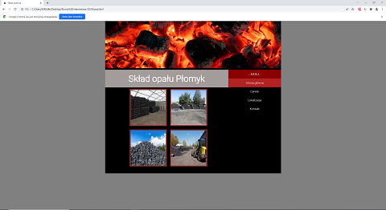

# Projekt strony internetowej
> Projekt prostej strony internetowej na przykładzie składu opału. Został wykonany na studiach na zaliczenie oraz nauki podstaw tworzenia stron www.

## Spis treści
* [Informacje ogólne](#informacje-ogólne)
* [Użyte technologie](#użyte-technologie)
* [Zrzuty ekranu](#zrzuty-ekranu)
* [Uruchomienie](#uruchomienie)
* [Status projektu](#status-projektu)

## Informacje ogolne
- Celem projektu było stworzenie strony internetowej wykorzystującej kilka frameworków.
- Tematyka strony ma zwiazek z moją poprzednią pracą.

## Użyte technologie
- JavaScript - wersja 1.9
- HTML - wersja 5
- CSS

## Zrzuty ekranu

## Uruchomienie
Po pobraniu pliku wystarczy użyć przeglądarki internetowej. Zalecane to:
- Chrome - wersja 	98.0.4758.82
- Firefox wersja 99.0

## Status projektu
Projekt został zakończony i nie ma planów dalszego jego rozwoju.

